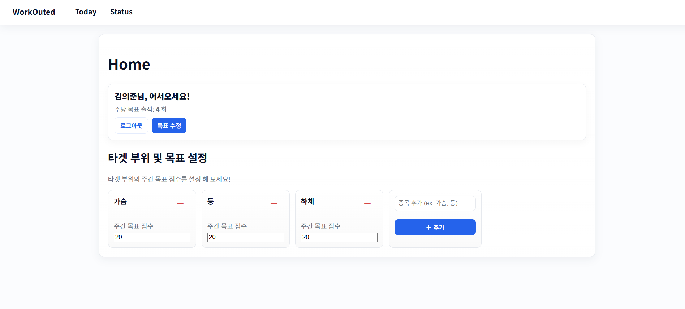
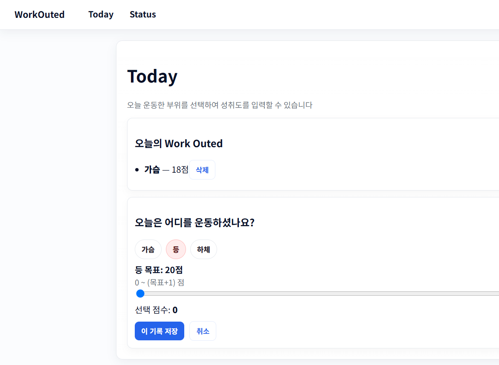
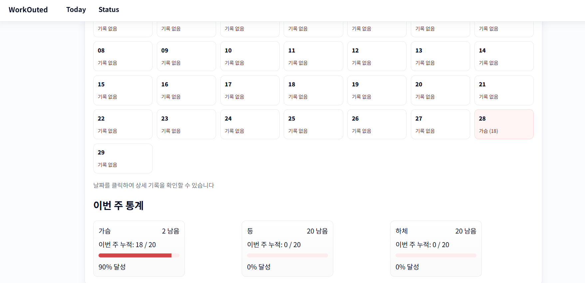

# 🏋️‍♂️ WorkOuted  
주간 운동 출석률과 부위별 점수를 기록하는 **React 기반 트래킹 웹**입니다.  

---
## 개요

WorkOuted는 일주일 동안 얼마나 꾸준히 운동했는지 확인할 수 있는 간단한 웹입니다.  
각 운동 부위에 점수를 기록하면, 출석 현황과 캘린더 기반 기록을 자동으로 확인할 수 있습니다.

LocalStorage를 임시로 사용해 UI를 우선 완성하고, 이후에 Firebase 등을 이용해  
실제 계정/동기화 기능을 추가하는 구조로 개발 중입니다.

---

## 스크린샷

## 주요 기능

### WorkOuted (Home)  
- 닉네임 설정, 로그인/로그아웃  
- 주당 목표 운동 횟수 설정  
- 운동 부위 추가/삭제  
- 부위별 주간 목표 점수 입력

### Today  
- 내가 설정한 운동 부위 클릭 후 오늘의 자기 운동 성취 점수 입력  
- 하루에도 여러 부위 기록 가능  
- 오늘의 기록 표시 및 삭제  

### Status  
- 연속 출석 일수 표시  
- 지난주 출석률 계산 (월요일~일요일 기준)  
- 월간 캘린더: 날짜별 총점 + 부위별 점수 표시  
- 날짜 클릭 시 상세 기록 표시  
- 이번 주 부위별 누적 점수 / 목표 달성률 표시

---

## 기술 스택
- React  
- React Router  
- Context API  
- localStorage (임시 DB)  
- JavaScript (JSX)