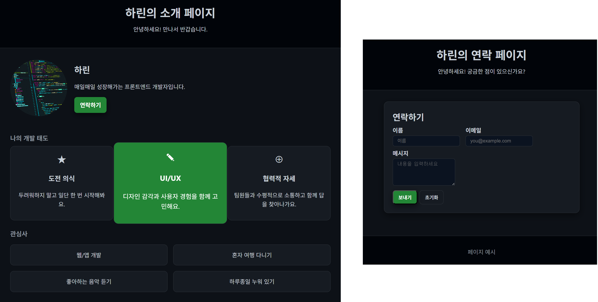

## 🌱 1주차 과제: 프로필 페이지 제작

웹 프론트엔드 커리큘럼의 첫 번째 과제로, **자기소개를 위한 프로필 페이지**를 제작해보도록 합시다! 
예쁘고 정돈된 형태가 아니라도 괜찮으니, 아래 조건을 참고하시어 배운 것을 최대한 활용하는 데 주안점을 두시면 됩니다.

---

## 📌 과제 요구사항

- 자신을 소개하는 **프로필 페이지 제작**
- **미디어 쿼리**를 포함한 CSS 요소 **3가지 이상 사용**
- **2개 이상의 페이지**로 구성 (메인 페이지 + 서브 페이지)

---

## 🧩 제출 방식

- 각자 본인의 이름으로 된 폴더를 생성한 뒤, 주차별 과제 폴더를 만들어 각 주차에 맞는 과제를 제출해주세요.
- 예시 구조
frontend-beginner/

├── harin/

│   ├── week1/

│   │   ├── index.html

│   │   ├── style.css

│   │   └── README.md

│   ├── week2/

│   └── week3/

├── sangeun/

🌿 브랜치 및 PR 제출 방식
- 각 과제는 **개인 브랜치에서 작업 후 PR(Pull Request)**을 통해 제출합니다.
- 멘토들이 과제 확인 후 병합할 수 있도록 main 브랜치에 바로 업로드 하지 말고 아래의 흐름을 따라 작업해주세요.

📌 브랜치 이름 규칙
- 이름_week1 형식으로 생성
예: harin_week1

🛠️ 작업 흐름
- main 브랜치에서 개인 브랜치 생성
- 브랜치에서 과제 작업 및 커밋
- 작업 완료 후 PR 생성
- 리뷰 후 main 브랜치에 머지

🛠️ 작업 흐름(git bash 명령어 포함)

    **작업 전**

    - https://github.com/aha-rin/frontend_beginner.git
    - cd frontend_beginner
    - git checkout main
    - git pull origin main (브랜치 최신 작업 상태 반영, 매번 작업을 할 때마다 입력해주세요!)
    - mkdir 본인이름
    - cd 본인이름
    - mkdir week1
    - git checkout -b 본인이름_week1

    **작업 후**

    - git add .
    - git commit -m "feat: week1 프로필 페이지 제작"
    - git push origin 본인이름_week1

✏️ 커밋 & PR 메시지 예시
- 커밋 메시지: feat: week1 프로필 페이지 제작
- PR 제목: [week1_하린] 프로필 페이지 과제 제출
- PR 설명: 작업한 내용 간단 요약 (사용한 CSS 요소, 페이지 구성 등)

---

## 🎨 예시 파일에서 사용한 CSS 요소 및 미디어 쿼리

- 미디어 쿼리를 통한 반응형 웹 디자인
- hover, transition을 이용한 사용자 인터랙션 효과
- grid, flex를 활용한 레이아웃 구성
- 클래스, 아이디 셀렉터 활용을 통한 요소별 스타일링

---

## 🧑‍💻 클래스 네이밍 규칙

- 이 프로젝트에서는 CSS 클래스 이름을 **BEM(Block Element Modifier)** 규칙에 따라 작성했습니다.
- BEM 규칙이란: https://velog.io/@nemo/bem
- 꼭 이 규칙을 따르지 않아도 괜찮습니다. 다만 변수의 이름을 일정한 규칙에 따라 지어주시길 부탁 드립니다. 일관성 있는 네이밍은 가독성과 유지보수에 큰 도움이 됩니다!