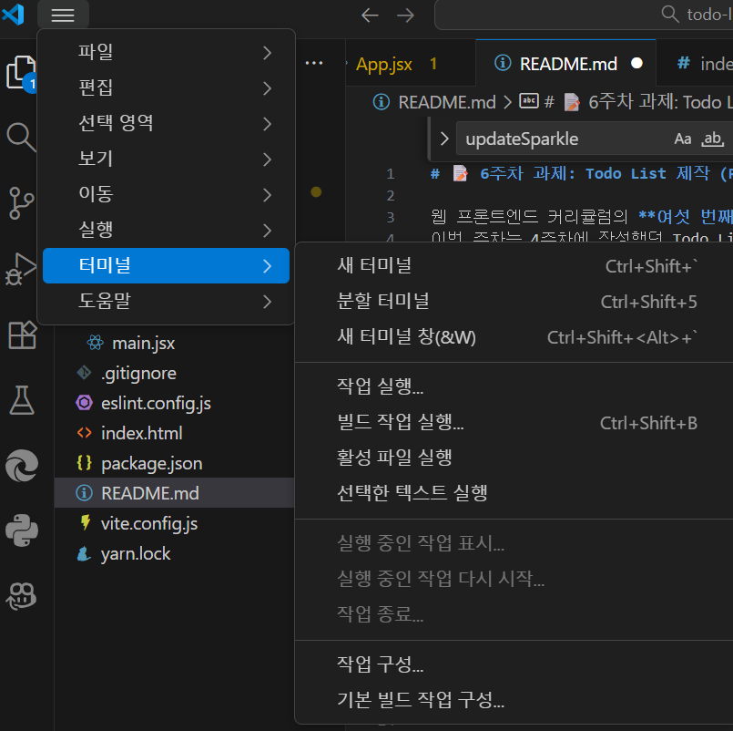
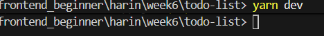
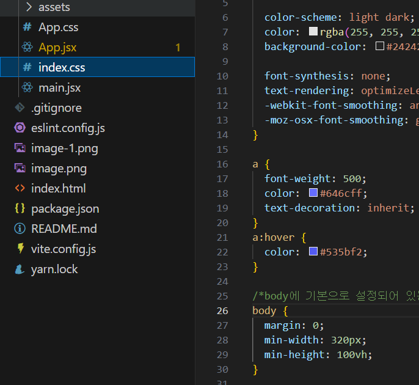

# 📝 6주차 과제: Todo List 제작 (React)

웹 프론트엔드 커리큘럼의 **여섯 번째 주차 과제**입니다.  
이번 주차는 4주차에 작성했던 Todo List 기능을 **React를 활용해 함수형 컴포넌트 기반으로 재구현**하는 것이 목표입니다.  
기존의 DOM 조작 방식에서 벗어나, **상태(state)와 컴포넌트 구조를 활용한 리액트 방식의 UI 구성**을 경험해봅시다.

---

## 📌 과제 요구사항

1. **React 환경 구성**
   - Vite를 활용한 React 프로젝트 생성 및 실행
   - 프로젝트 실행은 vscode 등의 에디터에서 새 터미널을 여시고 작성해주시면 됩니다.
   
   - 이때 프로젝트 실행 명령어를 입력하는 폴더 위치는 '프로젝트 폴더'입니다.
   
        - 프로젝트 생성(npm): npm create vite@latest
        - 프로젝트 실행(npm): npm run dev
        - 프로젝트 생성(yarn): yarn create vite
        - 프로젝트 실행(yarn): yarn dev
   - JSX 문법과 컴포넌트 구조 이해

2. **상태 관리**
   - `useState`를 활용한 할 일 목록 상태 관리
   - `useEffect`를 활용한 효과 제어(있다면)

---

## 🎨 구현 예시 아이디어

- `App.jsx`에서 전체 Todo List를 관리하고, 각 할 일을 컴포넌트로 분리
- 기존의 코드를 JSX 코드로 변환
- css의 경우 그대로 App.css에 복붙하시면 됩니다.
- index.css의 body 아래에 있는 display: flex, place-items:center를 지우셔야 이전에 Vanilla JS로 구현하셨던 것과 같은 웹 페이지 배열이 나올 겁니다.

- styled-components, Tainwind CSS, css 외부 파일 등 다양한 방법으로 css를 작성하셔도 좋습니다.

---

## 📂 제출 방식

- 본인 이름 폴더에서 우클릭-추가 옵션 표시-'open git bash here'

**작업 전**
- git pull origin main 
- git switch -c 본인이름_week6 origin/main  
- mkdir -p 본인이름/week6  
- cd 본인이름/week6  

**작업 후**
- git add .  
- git commit -m "feat: week6 투두리스트 React 구현"  
- git push origin 본인이름_week6  

---

## 🧑‍💻 클래스 네이밍 규칙

React(JavaScript)
- **camelCase**: 변수, 함수명 등 일반적인 식별자  
- **PascalCase**: 컴포넌트 이름 (예: `TodoItem`, `TodoList`)  
- **파일명도 PascalCase**로 작성하는 것을 권장합니다 (`TodoItem.jsx` 등)
